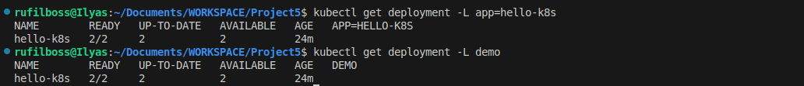
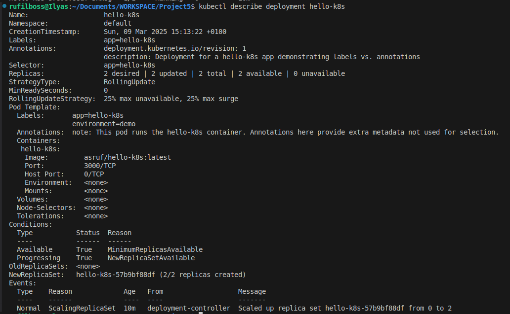

# Project5: Labels vs. Annotations in Kubernetes

This repository provides a sample Kubernetes deployment and service for a simple hello-k8s application. The goal is to demonstrate the practical difference between **labels** and **annotations** in Kubernetes.

## Overview

We use a hello-k8s container from Docker Hub (nginxdemos/hello:plain-text) to illustrate how to:

- Use **labels** to identify and group resources.
- Use **annotations** to store additional metadata that does not affect resource selection.

## Files

- **deployment.yaml**: Contains the Kubernetes Deployment configuration with both labels and annotations.
- **service.yaml**: Contains the Service configuration to expose the application.
- **README.md**: This document.

## How to Deploy

### Prerequisites

- A running Kubernetes cluster (e.g., using Minikube or AWS EKS).
- `kubectl` configured to access your cluster.

### Steps

1. **Clone the Repository:**

   ```bash
   git clone https://github.com/DevSecOpsHQ/Project5.git
   cd Project5
   ```

2. **Apply the Deployment Configuration:**

    ```bash
    kubectl apply -f kubernetes/
    ```
    <!-- This will create the Deployment Pods and Service. -->

3. **Verify the Deployment:**

    ```bash
    kubectl get pods
    kubectl get service hello-k8s-service
    ```

Then, try and get the pod using the label `app=hello-k8s` or `demo`:
<!-- Labels -->


We can also view our annotatins, by describing the deployment:
<!-- Annotatons -->


## Labels vs. Annotations

- **Labels:**
  - **Purpose:** Identify and group Kubernetes objects.
  - **Usage:** Controllers and selectors use labels to manage resources.
  - **Example:** In `deployment.yaml`, the label `app: hello-k8s` groups all pods belonging to this application.

- **Annotations:**
  - **Purpose:** Store non-identifying metadata.
  - **Usage:** Provide additional context (like descriptions, timestamps, or custom metadata) that doesn't affect how resources are selected.
  - **Example:** The annotation `note: "This pod runs the hello-k8s container..."` offers extra information without impacting resource selection.

## Conclusion

Understanding the distinction between labels and annotations is crucial for effective Kubernetes resource management. This simple project demonstrates how each is used and why both are important for maintaining well-organized, informative, and scalable deployments.

Happy learning!
